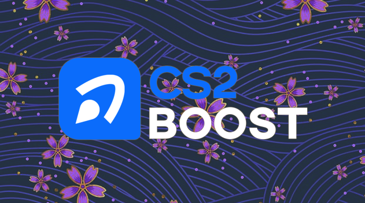

# CS2Boost



## Web Technical Information

CS2Boost is developed with ReactJS, React Redux, MongoDB, NodeJS, Express, socketIO, stripeAPI, firebase, radix ui, tailwindcss, i18n.

## Main function:

### Viewer:

- Toggle between dark & light mode.
- Adjust currency settings (USD/VND).
- Change language settings (EN/VI).
- Browse and place orders.

### User:

- Register and login using Gmail.
- Make payment via Stripe.
- Search, filter and track orders, invoices, partners.
- Chat with a partner.
- Receive the latest notifications about orders.
- Edit and update personal information (name, contact social media, ..etc)
- Display alerts for logins from unusual IP addresses.
- KYC using a QR code from CCCD card.
- Review partner after order completed.
- Report partner.

### Partner:

- Search, filter and track pending orders.
- Accept new orders.
- Search, filter, view and confirm completion or cancellation of accepted orders.
- Track revenue and order statistics by week or month.

### Admin:

- Dashboard with dynamic statistics (profit margin, total orders, revenue).
- Manage Users (Clients, Partners, Admins).
- Manage Orders (Track status, Assign partners).
- Manage Reports (Handle disputes between users and partners).
- Manage Transactions (Deposits, Withdrawals).
- Process Payouts for partners.
- Live Chat system to support users.
- Manage System Settings (Commission rates, penalties).
- Manage Promo Codes and Service Rates (Premier, Wingman, Level Farming).

## ERD (Entity Relationship Diagram):

```mermaid
erDiagram
    User ||--|| Wallet : has
    User ||--o{ Order : "places (as user)"
    User ||--o{ Order : "fulfills (as partner)"
    User ||--o{ Order : "assigned (as assign_partner)"
    User ||--o{ Transaction : has
    User ||--o{ Notification : "sends/receives"
    User ||--o{ Report : "sends/receives/handles"
    User ||--o{ Conversation : participants
    User ||--o{ Message : sends
    User ||--o{ Review : "gives/receives"
    User ||--o{ Payout : "requests/processes"
    User ||--o{ PartnerRequest : makes
    User ||--o{ Receipt : has
    User ||--|| Subscription : has
    User ||--o{ LiveChat : "requests/handles"
    User ||--o{ PromoCode : creates
    User ||--o{ SystemSettings : updates

    Order ||--|| Account : uses
    Order ||--|| Conversation : has
    Order ||--|| Review : has
    Order ||--o{ Receipt : has
    Order ||--o{ Report : "subject of"
    Order ||--o{ Transaction : "related to"

    Conversation ||--o{ Message : contains
    Conversation ||--o{ LiveChat : "part of"
    Conversation ||--o{ Report : "evidence for"

    BotConversation ||--o{ BotMessage : contains

    User {
        ObjectId _id
        string username
        string email_address
        string password
        string role
        number balance
        string partner_request_status
    }

    Wallet {
        ObjectId _id
        ObjectId owner
        number balance
        number escrow_balance
        number total_earnings
    }

    Order {
        ObjectId _id
        string title
        string type
        number price
        string status
        ObjectId user
        ObjectId partner
        ObjectId account
        ObjectId conversation
    }

    Account {
        ObjectId _id
        string user_id
        string login
        string password
        string game
    }

    Transaction {
        ObjectId _id
        ObjectId user
        string type
        number amount
        string status
        ObjectId related_order
        ObjectId related_payout
    }

    Payout {
        ObjectId _id
        ObjectId partner
        number amount
        string status
        ObjectId processed_by
        ObjectId transaction
    }

    Report {
        ObjectId _id
        ObjectId sender
        ObjectId receiver
        ObjectId handler
        ObjectId order
        string reason
        string status
    }

    Conversation {
        ObjectId _id
        ObjectId[] participants
        ObjectId[] messages
    }

    Message {
        ObjectId _id
        ObjectId sender
        ObjectId conversation_id
        string content
    }

    Review {
        ObjectId _id
        ObjectId sender
        ObjectId receiver
        ObjectId order
        number rating
        string content
    }

    Notification {
        ObjectId _id
        ObjectId sender
        ObjectId receiver
        string type
        string content
    }

    PartnerRequest {
        ObjectId _id
        ObjectId user
        string status
        string full_name
        string cccd_number
    }

    Receipt {
        ObjectId _id
        ObjectId order
        ObjectId user
        number price
        string status
    }

    PromoCode {
        ObjectId _id
        string code
        number discountPercent
        ObjectId createdBy
    }

    LiveChat {
        ObjectId _id
        ObjectId user
        ObjectId admin
        ObjectId conversation
        string status
    }

    Subscription {
        ObjectId _id
        ObjectId user
        string endpoint
    }

    BotConversation {
        ObjectId _id
        string user_id
    }

    BotMessage {
        ObjectId _id
        ObjectId conversation_id
        string role
        string text
    }

    SystemSettings {
        ObjectId _id
        number partnerCommissionRate
        ObjectId updatedBy
    }

    PremierRates {
        number unitPrice
    }
    WingmanRates {
        number unitPrice
    }
    LevelFarmingModel {
        number unitPrice
    }
    Announcement {
        string title
        string content
    }
    EmailTemplate {
        string name
        string subject
        string html_content
    }
```



## Testing:

```
- User account:
email: user.test@gmail.com
password: 0123@Abc
- Partner account:
email: partner.test@gmail.com
password: 0123@Abc
- Admin account:
email: admin.test@gmail.com
password: 0123@Abc
```
